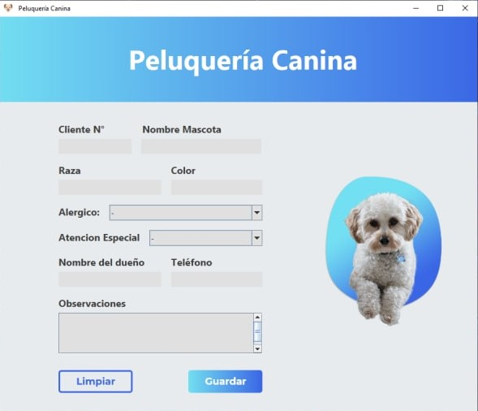

# Peluqueria canina

Programa desarrollado en Java SE que simula el registro de clientes de una peluqueria canina.

## Para la realizacion del proyecto se usó

- Java Swing - Para la interfaz grafica.
- JPA - Para la conexion con la base de datos.
- MYSQL - Para la base de datos.

### Caracteristicas de Java implementadas

- POO
- Modelo de capas (interfaz grafica, logica y persistencia)
- Listas (ArrayList)
